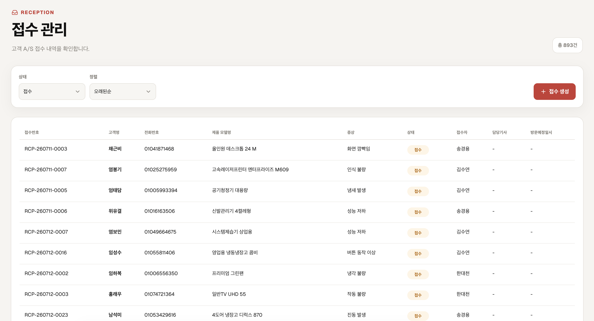
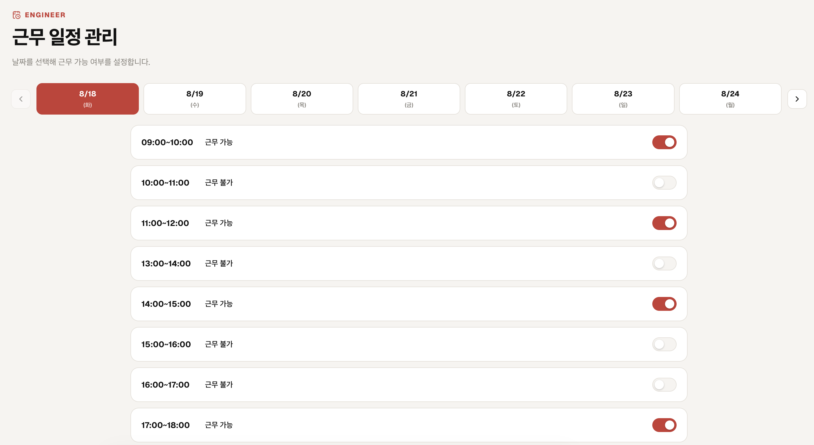
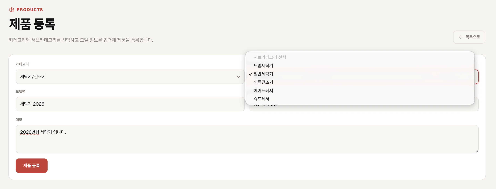
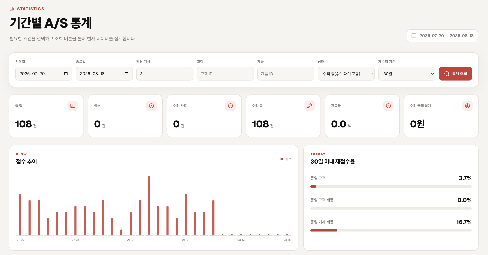
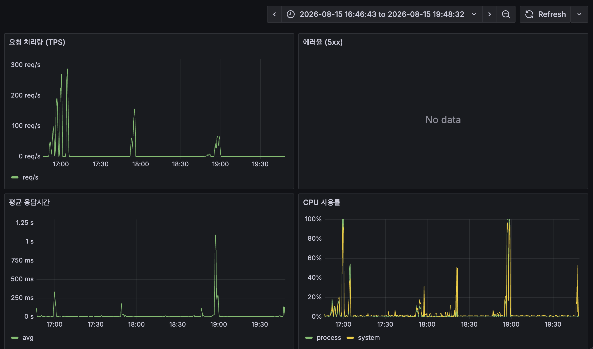
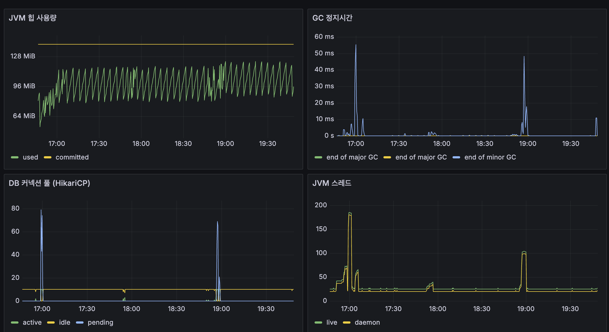

<div align="center">
  

# Noomit

> 전화·메모·엑셀로 흩어져 있던 A/S 접수부터 처리 완료까지를 한 플랫폼에서 관리하는 통합 A/S 접수 및 처리 서비스

</div>

## 프로젝트 소개

다수의 A/S 센터는 고객 요청과 수리 처리 내역을 전화, 메모, 엑셀 같은 비정형적인 방식으로 관리하고 있습니다. 이로 인해 접수 누락, 담당자 배정 지연, 처리 이력 추적 곤란 같은 문제가 반복적으로 발생하고, 업무 효율성과 고객 응대 품질 저하로 이어집니다.

`Noomit`은 상담원의 접수 등록부터 기사 배정, 수리 처리, 완료 승인까지의 흐름을 하나의 플랫폼으로 관리하고, 처리 상태를 실시간으로 추적해 업무 누락을 방지합니다. 축적된 처리 이력은 통계 대시보드로 이어져 운영 개선의 근거가 됩니다.

## 주요 기능

**접수 (상담원)**

- 고객 전화번호 조회/등록(upsert), 이름·전화번호 키워드 검색
- 접수 생성 및 접수번호 자동 채번(날짜별 순번)
- 접수 목록/상세 조회, 기사 배정 및 방문 슬롯 예약



**수리 (기사/관리자)**

- 기사 본인 담당 수리 케이스 목록/상세 조회
- 수리 내역(작업 항목 + 금액) 등록/삭제, 완료 제출
- 관리자 승인/반려, 전체 케이스 조회
- 기사 근무 가능 시간대(슬롯) 설정



**제품**

- 카테고리/서브카테고리/모델 관리



**통계**

- 접수·수리·고객·제품 도메인 데이터를 조합한 대시보드 (기간별 조회)



**인증 & 계정**

- 이메일/비밀번호 회원가입·로그인(세션 기반)
- 관리자 회원 권한 관리(역할 부여/조회) — `ADMIN` / `COUNSELOR` / `ENGINEER` / `DEVELOPER`

## 개발 기간 및 팀원

- 기간: 2026.08.06 ~ (진행 중)
- 인원: 5명 (Backend / Frontend 구분 없이 도메인 단위로 분담)

| GitHub | 담당 도메인 |
| --- | --- |
| [@ABCganada](https://github.com/ABCganada) | 공통 설정, 인증/회원, 인프라·배포, 부하테스트·모니터링 |
| [@julk0206](https://github.com/julk0206) | 접수(reception) |
| [@songgy0525](https://github.com/songgy0525) | 수리(repair) |
| [@cochae](https://github.com/cochae) | 고객(customer), 제품(product) |
| [@viinac](https://github.com/viinac) | 통계(statistics) |

## 기술 스택

| 영역 | 기술 |
| --- | --- |
| Backend | Java 25, Spring Boot 4, Spring Modulith, Spring Data JPA, Spring Security, Gradle |
| Frontend | Next.js(App Router) 16, React 19, TypeScript, Redux Toolkit, RTK Query |
| Database | PostgreSQL (Flyway 마이그레이션), HikariCP |
| 인증 | 세션 기반(HttpSession) + CSRF 토큰(쿠키) |
| 부하테스트/모니터링 | k6, Prometheus, Grafana |
| 인프라/배포 | Docker Compose, GitHub Actions, GHCR, Oracle Cloud Infrastructure, nginx |
| 협업 도구 | Slack, GitHub |

## 시스템 아키텍처

- 백엔드는 도메인별 패키지(`user`, `reception`, `customer`, `product`, `repair`, `statistics`)로 나뉜 **Spring Modulith 기반 모듈형 모놀리스**입니다. 도메인 간 부수 효과(예: 접수 배정 시 수리 케이스 자동 생성)는 `@ApplicationModuleListener` 기반 도메인 이벤트로 느슨하게 연결합니다.
- 통계 도메인은 자체 DB나 영속 엔티티를 갖지 않고, 접수·수리·고객·제품 도메인이 제공하는 공개 인터페이스를 통해 데이터를 조회해 메모리에서 집계합니다.
- 운영 환경은 Oracle Cloud 인스턴스(1GB) 위에서 Docker Compose로 컨테이너(nginx · frontend · backend)를 운영합니다. nginx가 TLS 종단과 리버스 프록시를 담당합니다.
- 운영 서버의 actuator(`/actuator/prometheus`)는 `127.0.0.1`에만 바인딩되어 인터넷에 노출되지 않으며, 개발자는 SSH 터널로만 접근해 로컬 Prometheus/Grafana로 지표를 관찰합니다.
- CI(GitHub Actions)는 이미지를 빌드해 GHCR에 push하고, CD는 `main` push 시 이어서 SSH로 운영 서버에 접속해 컨테이너를 재배포합니다. 즉 **`main` 머지가 곧 운영 배포**입니다.

## 주요 구현 내용

**인증/회원**

- 이메일/비밀번호 회원가입, 세션 기반 로그인/로그아웃
- `ADMIN` / `COUNSELOR` / `ENGINEER` / `DEVELOPER` 역할 기반 인가 — URL 패턴(`/api/{role}/**`)과 `@PreAuthorize`로 이중 체크
- 관리자 페이지에서 회원별 역할 부여/조회

**접수(reception)**

- 고객을 전화번호로 조회해 접수를 등록하고, 미등록 고객은 접수와 함께 신규 등록(upsert)
- 접수 시 날짜별 순번으로 접수번호(`RCP-yyMMdd-####`)를 자동 채번
- 상담원의 접수 목록/상세 조회, 기사 배정 및 방문 슬롯 예약
- 기사 배정이 완료되면 도메인 이벤트로 수리 도메인에 수리 케이스가 자동 생성됨

**고객(customer)**

- 전화번호를 유니크 키로 한 upsert — 이미 등록된 번호면 갱신, 없으면 신규 등록
- 이름/전화번호 키워드 부분 일치 검색

**제품(product)**

- 카테고리 → 서브카테고리 → 모델 계층 구조 관리

**수리(repair)**

- 기사 본인 담당 수리 케이스 목록/상세 조회
- 수리 내역(작업 항목 + 금액) 등록/삭제
- 진행중(`IN_PROGRESS`) → 제출(`SUBMITTED`) → 완료(`COMPLETED`) 상태 전이, 관리자 승인/반려

**통계(statistics)**

- 자체 DB 없이 접수·수리·고객·제품 도메인의 공개 인터페이스를 조회해 기간별 대시보드로 집계

## 로컬 실행

### 사전 준비

- JDK 25
- Docker Desktop
- Node.js (프론트엔드 `package.json` 참고)

### 1. Backend

```bash
cd backend
docker compose -f docker-compose.local.yml up -d
./gradlew bootRun
```

- 기본 주소: `http://localhost:8080`
- 테스트: `./gradlew test`

### 2. Frontend

```bash
cp frontend/.env.example frontend/.env.development.local
cd frontend
npm ci
npm run dev
```

- 개발 서버: `http://localhost:3000`

### 환경변수

```bash
cp .env.example .env
```

비밀값(DB 접속 정보 등)은 Git에 커밋하지 않습니다.

## 부하테스트 & 모니터링

운영 인스턴스(OCI 1GB, `-Xmx256m`)를 대상으로 [`k6/`](k6)에 도메인별 부하테스트 스크립트가 있습니다. 인증이 필요한 엔드포인트는 전부 `setup()`에서 로그인을 1회만 수행해 모든 VU가 세션을 공유하는 패턴을 따릅니다.

```bash
k6 run \
  -e BASE_URL=https://noomit.abcganada.xyz \
  -e TEST_EMAIL=<테스트 계정> \
  -e TEST_PASSWORD=<비밀번호> \
  -e PEAK_VUS=20 \
  k6/<도메인>-load-test/<스크립트>.ts
```

서버 상태(CPU, JVM 힙, HikariCP 커넥션 풀 등)는 로컬에 띄운 Prometheus + Grafana로 관찰합니다. 운영 actuator는 `127.0.0.1`에만 바인딩돼 있어 SSH 터널이 먼저 필요합니다.

```bash
ssh -L 8080:localhost:8080 <운영 서버>
cd monitoring && docker compose up -d
```

부하테스트 중 실제로 관찰한 대시보드입니다 — 요청 처리량/에러율/응답시간/CPU(위), JVM 힙/GC 정지시간/HikariCP 풀/스레드(아래).





## 배포

`main` 브랜치에 머지되면 GitHub Actions가 이미지를 빌드해 GHCR에 push하고, 이어서 SSH로 운영 인스턴스(Oracle Cloud)에 배포합니다(`.github/workflows/ci.yml`, `deploy.yml`).

## 팀 규칙

- **브랜치 전략**: `<type>/<handle>/<topic>` 형식(예: `feat/abcganada/role-based-authorization`)으로 분기해 `main`에 PR로 merge합니다. 별도 개발 서버 브랜치 없이, `main` 머지가 곧 운영 배포로 이어집니다.
- **커밋 메시지**: Conventional Commits 스타일(`feat`, `fix`, `refactor`, `test`, `chore`, `docs`, `ci`, `style`, `perf`)의 한글 메시지를 사용합니다.
- **PR**: `.github/PULL_REQUEST_TEMPLATE.md` 형식(변경 분류 체크박스, 주요 변경사항, 브랜치 정보)을 따르고, CI 통과 후 merge합니다.
